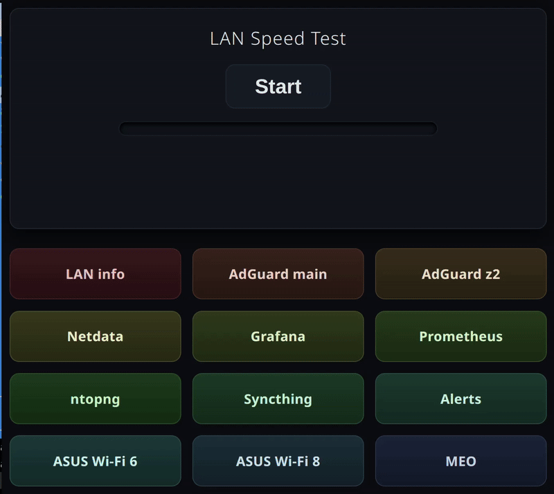

#  Fancy Homelab Homepage & LAN Speedtest

**fancy-homelab-homepage** is an ultra-lightweight, self-contained dashboard for your homelab. It serves as a beautiful catalog for your internal network resources and features a built-in LAN speed test.

Built purely with vanilla HTML, CSS, and JavaScript. No build tools, no heavy frameworks, no dependencies. 

**✨ Vibecoded with Gemini** 
 

 

##  Features

* **Static & Self-Contained:** Runs on absolutely any web server that can serve static files (Nginx, Apache, Caddy, Python `http.server`, etc.).
* **Dynamic Services Catalog:** Populated via a simple `services.json` file. 
* **Accurate LAN Speedtest:** Browser-based download speed test using a non-compressible payload to ensure accurate network hardware benchmarking. After a speed test, the dashboard launches a visual ping matrix, testing the reachability of all your services.

--- 

## 🛠️ Installation & Setup

Because this is a completely static project, setup takes less than a minute.

### 1. Clone the repository
Drop the `src` into your web server's document root.

### 2. Generate the Speed Test Payload
Run this command in the project directory to generate the secure payload: `head -c 100M /dev/urandom > speedtest.bin`

You must generate this file using random data. If you use a zero-filled file (like with fallocate), modern web servers and network switches will compress the payload on the fly, resulting in physically impossible speed readings (e.g., 50,000 Mbps on a Gigabit link).

### 3. Configure services list
See `src/services.json`

### 4. Serve it!
Point your web server (Nginx, Apache, etc.) to the directory. If you just want to test it locally, you can use Python: `python -m http.server 8080`. Then visit http://localhost:8080 in your browser.
